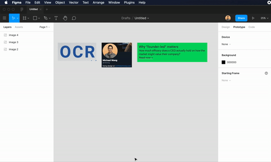

# Text From Image

A Figma plugin. Ever need to grab the text from a static image fill in Figma? This plugin uses [ocr.space](https://ocr.space) to copy the text from an image onto your clipboard. Note: You'll need to obtain your own free API key before you start using the plugin.    

- `yarn` — This will initialize the project and install any dependencies
- `yarn webpack` — This will output a production build in the `dist` directory.